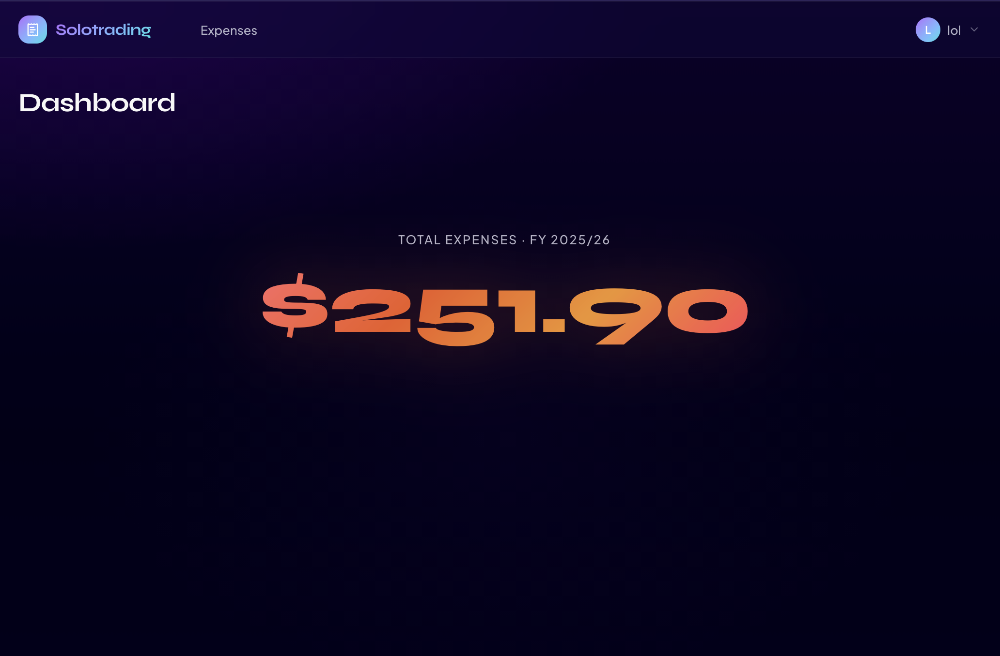
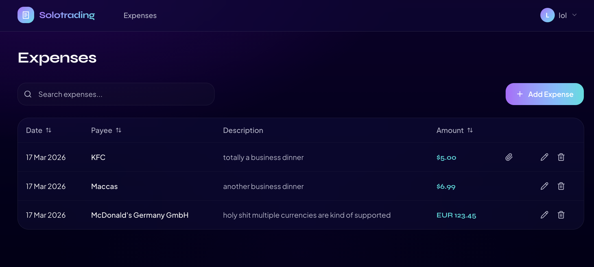

# Solo Trading

A helpful dashboard for solo traders. 100% vibe coded (except for this readme) and with the UI like web 3.0 was still a thing.

# Features

- expense tracker

Yeah, that's it, I only need expenses for now so that's everything there is. Stay tuned as I might be adding more features in the future.

# Running

## Development

1. `bun install`
2. `bun db:push`
3. `bun dev`

## Production

How adventurous, deploying a vibe coded project to production!

Check out [docker/docker-compose.yml](docker/docker-compose.yml).
